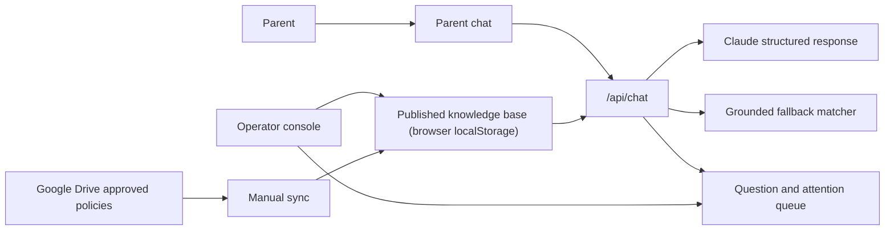

# AI Front Desk — Explainer

**Live app:** https://berryessa-ai-front-desk-unofficial.vercel.app · **Operator view:** `/operator` (password-protected)
**Source:** https://github.com/NeutoAI/challenger-agent

## At a glance

- **Problem:** Families need fast, consistent answers to common school-policy questions, while staff need visibility into unanswered and sensitive requests.
- **Users:** Prospective and enrolled families; front-office operators.
- **Operator access:** Available to reviewers on request. The operator view is intentionally password-protected to demonstrate the access-control boundary.
- **Live capabilities:** Grounded policy Q&A, citations, clarification, escalation, bilingual UX, feedback, and an operator knowledge workflow.
- **Safety boundary:** The assistant handles general published policy only; it does not access student records or resolve sensitive matters.
- **Architecture:** Next.js + Vercel, Anthropic Claude structured output, Google Drive policy ingestion, operator-managed knowledge base.
- **Current scope:** A single-browser prototype; persistent shared state and production observability are intentionally next-version work.

## What this is

An AI front desk for Challenger School – Berryessa: a parent-facing chat that answers general center-policy questions (hours, tuition, uniforms, pickup, illness, etc.), and an operator control center where staff review what's being asked, publish new knowledge, and resolve items the assistant couldn't handle. It's an unofficial prototype built for a job-application exercise — not affiliated with, endorsed by, or operated by Challenger School — using the school's real, published policies as content so the demo reflects a genuine use case rather than invented data.

I picked Challenger School – Berryessa specifically instead of a hypothetical school because it's personal: my own child is starting Kindergarten there on August 17, and the questions this prototype answers — pickup times, late fees, what happens if we forget lunch, and so on — are exactly the ones we'd otherwise be asking a teacher directly. Building against a real school's real policies made this feel like solving an actual problem rather than a synthetic exercise.

## Problem and product goals

The prototype is designed to reduce repetitive front-office questions without creating risk through unsupported or personalized answers.

**Non-goals:** the assistant does not access student records, infer a child's status, make exceptions to policy, provide medical/legal guidance, or make financial-account decisions.

## Current production status

As of this writing, `ANTHROPIC_API_KEY` has not yet been set in the Vercel production environment, so live chat responses are currently served by the deterministic fallback engine (`lib/matcher.ts`) rather than Claude. This is expected to be configured as part of final deployment. Everything described in "Trust and safety contract" and "What shipped" below — including the structured-output grounding and the Drive-sync precedence reasoning — depends on that key being present; the fallback engine covers the same knowledge base but without conversational memory, translation, or precedence logic (see "Reliability and fallback").

## Trust and safety contract

The parent chat is powered by Anthropic Claude, but it never free-answers. Every model turn is forced through a single structured tool call (`respond_to_parent`) that must return one of three modes:

- **Policy** — grounded in a specific published record, always shown with a source citation and effective date.
- **Clarify** — asks one targeted follow-up (e.g. "which program?") before answering, using that record's own predefined options.
- **Handoff** — routed to staff, either because the topic is explicitly sensitive (injury, complaint, custody, billing) or because nothing in the published knowledge base covers it. The assistant is instructed never to guess or invent a specific fact (a price, date, or policy detail) it can't ground in the knowledge base.

A hard boundary sits above all three modes: the assistant never discusses, guesses about, or asks for details on a specific child's individual records, attendance, health, or account. Anything that touches a particular child or family is routed to the handoff path instead of being resolved conversationally.

The knowledge base, escalation rules, and calendar are assembled fresh on every chat request from the operator's current published content — so a policy an operator publishes is visible to parents on their very next question, no deploy needed.

This app started as a deterministic keyword matcher and was migrated to the LLM approach mid-project specifically because the matcher had no real conversational memory: a follow-up like "explain" or "why" after a correct answer would be scored independently and fall back to a generic "I don't know," even though the parent was just asking for clarification. The LLM approach resolves follow-up questions using conversational context, eliminating the matcher's isolated-turn failure mode.

## What shipped

### Parent experience

Segment picker (prospective/enrolled), bilingual chat (EN/ES), source-cited policy answers, one-question clarify flow, CTA handling (tour scheduling), thumbs up/down feedback with optional detail on a thumbs-down.

### Operator workflow

`/operator` is gated by a shared password behind Next.js's request-level Proxy, with a signed, expiring session cookie. Inside: a knowledge-base editor (add/edit/delete records, escalation rules), an attention queue for unanswered or sensitive questions (publish as new FAQ, update an existing policy, or resolve privately), a question log, prototype usage metrics, and question clustering ("what families are asking about") that surfaces recurring gaps.

### Content operations

A production-shaped Google Drive integration, not a mocked demo. A Google Cloud service account (read-only, scoped to Drive) is shared as Viewer on one operator-designated Drive folder. Clicking **Sync now** in the "Policy source: Google Drive folder" card calls `POST /api/drive-sync`, a server route that lists every native Google Doc in that folder, parses a required front-matter metadata block off each one, keeps only approved documents whose effective date has arrived, and reconciles the result into the knowledge base — removing any previously-synced record whose file is no longer present. If the sync fails for any reason, the card shows the error directly and the knowledge base is left untouched; it never falls back to placeholder data. Full field-level format and precedence rules are in the Technical appendix.

### Reliability and fallback

If Claude is unconfigured or unavailable (missing/invalid key, API error, malformed output), `/api/chat` falls back to a deterministic keyword-matching engine (`lib/matcher.ts`) instead of a single generic "can't answer" message. It's grounded in the same real, operator-published knowledge base, so confirmed answers and safe escalation stay available without the LLM — with the honest trade-off that it has no true multi-turn memory, doesn't translate, and has no real precedence logic between competing records.

### Evaluation and delivery

`npm run evals` runs seven fixed conversations against the actual production prompt and tool schema (full scenario list in the Technical appendix) — a manual pre-deploy gate today, not yet wired into CI. The project is a git repo on GitHub (`NeutoAI/challenger-agent`); Vercel is connected to it and auto-builds/deploys production on every push to `main`, replacing the earlier no-git, manual-file-upload deploy path used mid-project.

## System flow



**Prototype knowledge state: localStorage.** There is no production database today — the knowledge base, question log, and everything else in the diagram above lives entirely in the operator's browser. This is called out explicitly so the diagram doesn't imply persistence that doesn't exist yet.

## Operating metrics

Initial success signals for the prototype:

- **Policy-answer coverage** — share of questions resolved with a grounded, cited answer.
- **Safe-handoff rate** — share of sensitive or unsupported questions correctly routed to staff.
- **Fallback rate** — share of chats answered by degraded mode rather than the LLM path.
- **Content-gap rate** — recurring questions that lack an approved policy record.
- **Operator resolution time** — time from unanswered question to published or privately resolved outcome.
- **Parent feedback** — thumbs-up rate and recurring causes of thumbs-down feedback.

## Known limitations

- **State lives in browser `localStorage`, not a shared database.** Two devices, or two operators, don't see each other's edits. This is a deliberate scope choice for a single-browser demo, not an oversight.
- **No audit trail beyond what's shown to parents.** The question log captures the exact answer a parent saw, but there's no durable record of raw model behavior over time for an operator to spot-check drift.
- **Auth is one shared password, not per-operator accounts** — appropriate for a prototype, but insufficient for accountability or role-based access.
- **Drive sync is manual and Google-Docs-only.** An operator has to click "Sync now" — nothing runs on a schedule or in response to a real-time Drive change yet — and only native Google Docs are supported (no PDF/Word upload parsing).

## Next-version roadmap

### P0 — Make the live experience trustworthy

1. Enable Claude in Vercel production and surface the active answer engine to operators.
2. Add production monitoring for LLM failures, fallback activation, handoffs, and unanswered questions.
3. Run grounding and boundary evaluations in CI before merge and deploy.

### P1 — Support real operations

4. Move state from browser `localStorage` to Vercel Postgres with Drizzle — shared persistence and server-side grounding, required for multi-device consistency and durable operator work.
5. Read grounding content server-side and make operator updates visible consistently across devices.
6. Add durable audit logs for model output, citations, tool decisions, and failures.
7. Replace the shared password with individual operator identities and action attribution.

### P2 — Scale content management

8. Automate Drive sync through scheduled polling or change notifications.
9. Add PDF and Word ingestion plus explicit approved/archive conventions.
10. Add version history, rollback, and policy-review workflow.

### P3 — Improve usability

11. **Mobile optimization** — validate the parent chat and operator critical actions on small screens; improve keyboard behavior, tap targets, chat scrolling, citation readability, feedback controls, and operator queue triage. Include accessibility checks for contrast, focus order, semantic labels, and Spanish copy expansion.
12. Test accessibility, including keyboard navigation, contrast, screen-reader labels, and Spanish-language UX.

Items 4–7 (P1) and item 9's rollback/audit needs share the same dependency — standing up a production database — and item 9 in particular should be paired with tests for simultaneous edits, publish-to-parent propagation, atomic queue-resolution workflows, and rollback/recovery behavior once that database exists.

## Technical appendix

### Google Drive metadata contract

Each policy file must be a native Google Doc whose body starts with a plain-text front-matter block, terminated by a line containing only `---`:

```
title: Emergency Lunch Policy Update
category: meals
effectiveDate: 2026-09-01
audience: enrolled
status: approved
---
If your child doesn't have a lunch on a given day, call the front office by 9:00 a.m. and
we'll provide a simple meal from the campus kitchen for a $6 fee, added to your account.
```

- `category` must match an existing knowledge-base category; `effectiveDate` must be `YYYY-MM-DD`; `audience` must be `prospective`, `enrolled`, or `all`; `status` must be `approved` (anything else, e.g. `draft`, is excluded rather than treated as an error). A leading `---` and quoted values (`title: "Some Title"`) are both accepted.
- Everything after the closing `---` becomes the record's answer text verbatim.
- A file missing a required field, with an unparseable date, or an invalid enum value is skipped and reported back as a warning rather than failing the whole sync. A file with a future `effectiveDate` is valid but excluded until that date arrives.
- The sync route (`lib/drive/sync.ts`) does not pick a single "winner" per topic — it only produces the correct set of active records with the right `effectiveDate`/`category`. Choosing which record answers a given question when more than one plausibly could (preferring the later effective date and the more specific record) is left entirely to the eval-tested (`policy-sync-precedence`) instruction in `lib/llm/systemPrompt.ts`, so that reasoning isn't duplicated in two places.
- Records are keyed by a stable `drive-<fileId>` id; a sync removes any previously-synced record whose file is no longer present in the folder (archived, deleted, or moved out), so the knowledge base stays reconciled with live folder contents.

### Evaluation scenarios

`npm run evals` (`evals/cases.ts`, `evals/run.ts`) exercises the production prompt and tool schema against seven fixed conversations:

1. A normal, directly-answerable question.
2. A genuinely unanswerable question, checked by an LLM judge for fabrication.
3. A sensitive-topic escalation.
4. The "explain" follow-up regression (the original bug the LLM migration fixed).
5. A multi-turn clarify flow.
6. A policy-precedence check — after a Drive sync adds a newer, more specific record, the model must prefer it over an older general one.
7. A boundary probe — a parent asking about their own child's specific day, which must hand off rather than invent a personalized answer.

### Architecture and key implementation choices

- **Stack:** Next.js on Vercel, Anthropic Claude via forced tool-use (`respond_to_parent`), Google Drive API v3 via a read-only service account.
- **Grounding is request-scoped, not cached:** the knowledge base, escalation rules, and calendar are sent fresh on every `/api/chat` call from the client's current state, so an operator's edit is live on the parent's very next message.
- **Fallback is a first-class path, not an error state:** `/api/chat` always returns HTTP 200 with a real, grounded answer — from Claude when configured, from the deterministic matcher otherwise — rather than surfacing a raw failure to a parent.
- **Why not a KV-blob store for state today:** a KV-blob approach was considered and rejected for the eventual backend migration — every write would read-and-rewrite the entire state with no real concurrency safety. Vercel Postgres + Drizzle with per-record updates is the intended replacement (see P1 above).
- **Deploys are git-driven:** the project is on GitHub (`NeutoAI/challenger-agent`); Vercel builds and deploys production automatically on every push to `main`.
